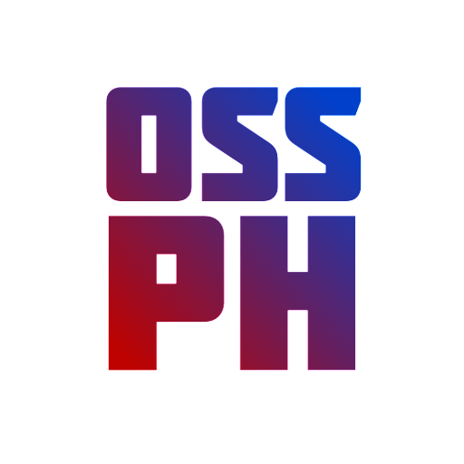

# 3 Million Logo Builder

> **Warning**: This is a meme open-source project. It is not intended to be used in production. Use this at your own risk. 😂😂😂

    

The **3 Million Logo Builder** is a simple Node.js tool that allows you to make your logo worth ₱3 Million by adding crazy gradient overlay into your existing logo programmatically. ([icymi](https://mb.com.ph/2023/7/13/nagsasayang-ng-pera-house-probe-on-pagcor-s-new-logo-sought)) 😂😂😂

## 📷 Demo

| Before | After |
| :---: | :---: |
|  |  |

> This is logo of [Open Source Software Philippines](https://ossph.org) community before and after using this project. 😂

## 🤔 Why I Build This?

I build this project because why not? I'm curious how I can turn any existing logo into gradient of red and blue color style by just automating it programmatically. 😂

[Learn More] _(my write up about this project)_

## 📝 Requirements

### 🖼️ Image/Logo

- Existing logo of your company or organization. (Preferably in PNG format)
- Dimension of the logo must be 512x512 pixels.
- Must be in white color format or variation.

## 🚀 Getting Started

1. Clone the repository.
2. Navigate to the root folder.
3. Run `yarn install` to install dependencies.
4. Place your existing logo in `input` folder.
5. Run `yarn build` to start generating your new logo.
6. Get your logo in `output` folder.
7. Done... 🎉🎉🎉

## 🙋‍♂️ FAQs

### Do you have plans to create a GUI/Dashboard version of this?

No, I don't have plans to create a GUI version of this. I'm too lazy to do that and I have skill issues. 😂 If you are building a version of this in GUI let me know I'll add your project here. 😂

### Can I use this in production?

No, this is just a meme project. 😂

### Can I use this for my company?

Yes, you can use this for your company. But I'm not responsible for any legal issues that may arise. 😂

### Are you planning to add more features?

No, I don't have plans to add more features. But if you have any suggestions feel free to create a pull request. 🫡

### Can I contribute to this project?

Yes, you can contribute to this project. Just create a pull request and we will review your code. 🙏

### Can we expect a CLI version of this?

If we reach 500 active users, we can consider implementing this feature in the future. 👀

## 🎯 Contributing

Contributions are welcome, create a pull request to this repo and we will review your code. Please consider to submit your pull request to the `dev` branch. Thank you!

Read the project's [contributing guide](./contributing.md) for more info.

## 🐛 Issues

Please report any issues or bugs by [creating a new issue here](https://github.com/warengonzaga/3m-logo-builder/issues/new/choose), also make sure you're reporting an issue that doesn't exist. Any help to improve the project would be appreciated. Thanks! 🙏✨

## 📋 Code of Conduct

Read the project's [code of conduct](./code_of_conduct.md).

## 📃 License

This project is licensed under [GNU General Public License v3](https://opensource.org/licenses/GPL-3.0).

## 📝 Author

This project is developed and maintained by [Waren Gonzaga](https://github.com/warengonzaga) with the help of awesome [contributors](https://github.com/warengonzaga/3m-logo-builder/graphs/contributors).

---

💻💖☕ by [Waren Gonzaga](https://warengonzaga.com) | [He is Awesome](https://www.youtube.com/watch?v=HHrxS4diLew&t=44s) 🙏
